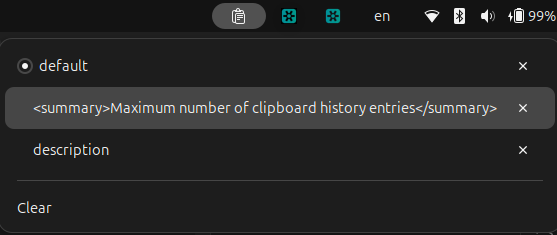
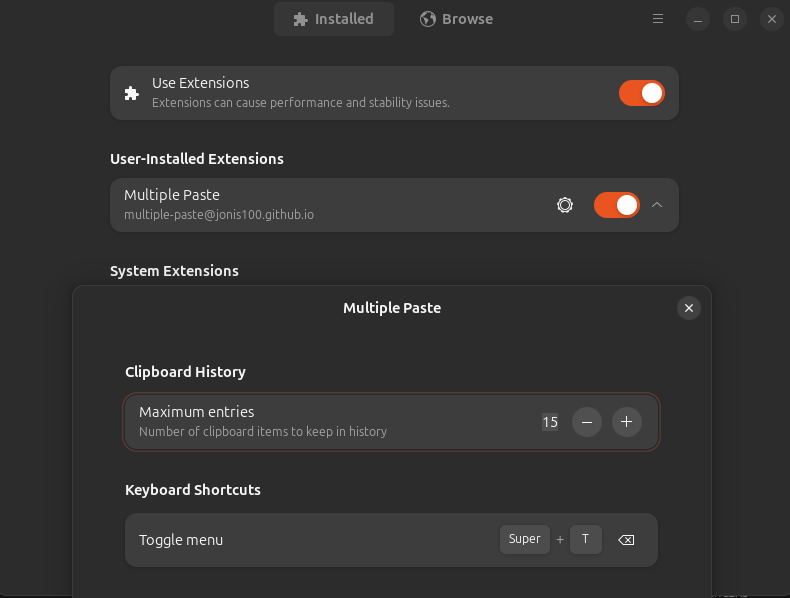

# Multiple Paste

A lightweight clipboard history manager for GNOME Shell.

## Screenshots



_Clipboard history popup — click any entry to copy it back to the clipboard, or delete individual items._



_Settings — configure the maximum number of entries and the toggle menu shortcut._

- View and configure the number of saved clipboard items (default: 30)
- Click an item to restore it to the clipboard
- Delete individual items or clear all history
- History persists across sessions via a cache file
- Hides automatically when clipboard history is empty

## Settings

Open the **Extensions** app and click the gear icon next to Multiple Paste to configure:

| Setting         | Default | Description                                       |
| --------------- | ------- | ------------------------------------------------- |
| Maximum entries | 30      | Number of clipboard items kept in history (1–100) |
| Toggle menu     | Super+T | Open or close the history menu                    |

Click the shortcut row to capture a new key combination, or clear it with the ✕ button. Changes take effect immediately without restarting.

## Installation

### From extensions.gnome.org

Install the extension from the [official gnome extension page](https://extensions.gnome.org/extension/9567/multiple-paste/)

### Manual

```bash
git clone https://github.com/jonis100/gnome-multiple-paste.git ~/.local/share/gnome-shell/extensions/multiple-paste@jonis100.github.io
```

Then restart GNOME Shell (`Alt+F2` → `r` on X11, or log out/in on Wayland).

## Inspiration

- [Clipman](https://github.com/popov895/Clipman) by popov895
- [Clipboard Indicator](https://github.com/Dieg0Js/gnome-clipboard-indicator) by Dieg0Js

## License

MIT
